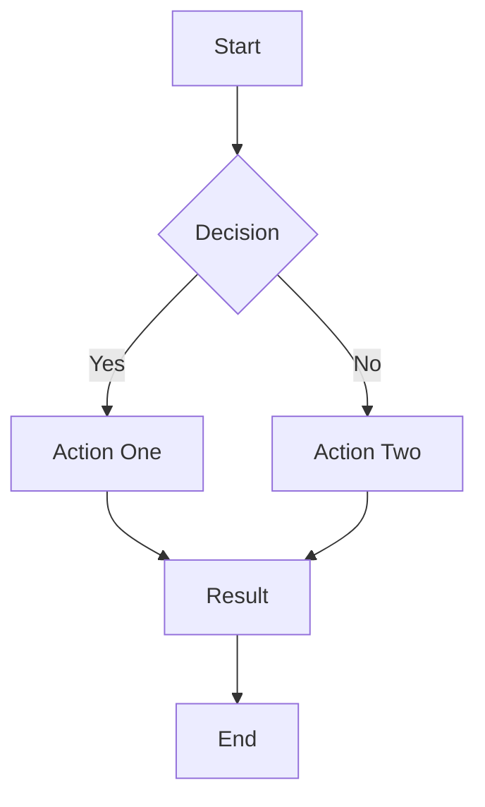
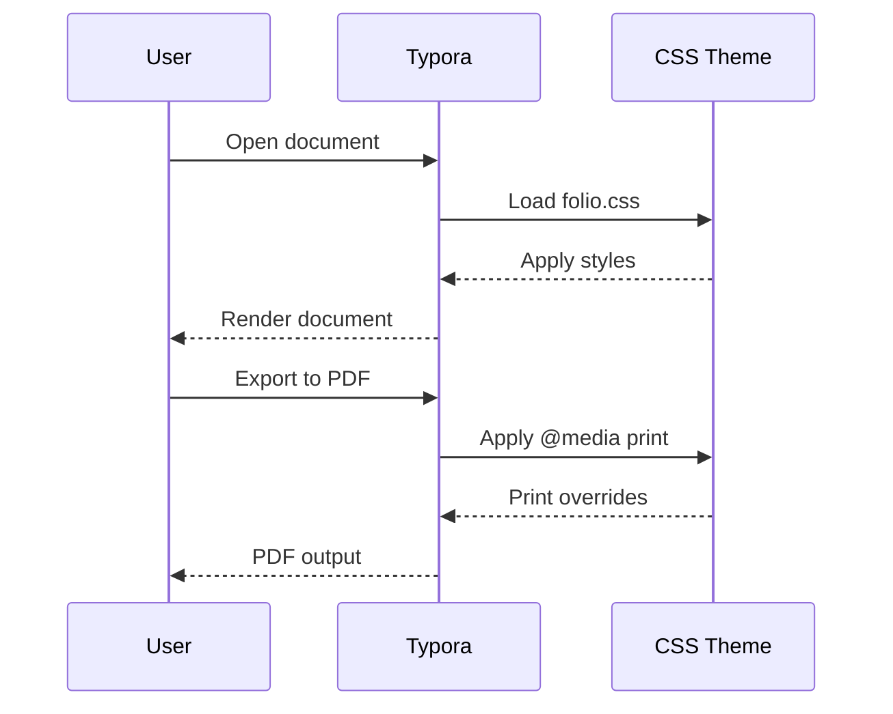

# Folio Theme Test Document

This file is a verification suite for `folio.css`. Open it in Typora with the Folio theme active, then export to PDF. Walk through each section and confirm the checkpoint listed at the top of each test.

[TOC]

---

## 1. Headings (§4)

**Checkpoint:** No heading should appear stranded at the bottom of a page without at least one line of following content on the same page.

### Third-level heading

Body text immediately following an h3. This paragraph must appear on the same page as the heading above — never on the next page.

#### Fourth-level heading

Body text following an h4. Same rule: heading and this paragraph share a page.

##### Fifth-level heading

Body text following an h5.

###### Sixth-level heading

This is h6 — same size as body text, muted color. Confirm it renders in `--color-text-muted` (#555555).

---

## 2. Body Text & Inline Styles (§5, §8)

**Checkpoint:** Paragraphs have orphan/widow control (minimum 3 lines on each side of a page break). Inline code has a visible background and border.

This is a normal paragraph with **bold text**, *italic text*, ***bold italic text***, and ~~strikethrough~~. Here is `inline code` which should have a light gray background (`#f6f6f6`) and a thin border.

Here is a [hyperlink to example.com](https://example.com) — it should be colored `#0055aa` and have no underline until hovered.

This is a longer paragraph designed to test orphan and widow control. When this paragraph falls near a page boundary during PDF export, the rendering engine should ensure that at least three lines remain on the originating page (no orphans) and at least three lines carry over to the next page (no widows). If fewer than three lines would be stranded on either side, the entire paragraph should shift to avoid that situation. This behavior is controlled by the `orphans: 3` and `widows: 3` CSS properties applied to the `p` element. The paragraph intentionally contains enough text to span multiple lines at the default 10pt body size, providing a realistic test of the line-counting behavior. Additional filler text follows to reach the necessary length for testing purposes. The quick brown fox jumps over the lazy dog. Pack my box with five dozen liquor jugs. How vexingly quick daft zebras jump.

Here is some ==highlighted text== to verify the `mark` element styling — yellow background (`#fff3cd`), subtle padding, rounded corners.

---

## 3. Lists (§6)

**Checkpoint:** List items should not split across pages. Nested lists collapse outer margins. Task list checkboxes are properly aligned.

### Unordered list

- First item in the list
- Second item — contains `inline code` and **bold text**
- Third item with a longer description that wraps to multiple lines to test whether the list item avoids breaking across a page boundary during PDF export
- Fourth item
  - Nested item one
  - Nested item two
    - Deeply nested item
  - Nested item three
- Fifth item

### Ordered list

1. First numbered item
2. Second numbered item with enough text to potentially wrap across a line boundary and test alignment of continuation text
3. Third numbered item
4. Fourth numbered item
   1. Nested numbered item
   2. Another nested numbered item
5. Fifth numbered item

### Task list

- [x] Completed task
- [x] Another completed task
- [ ] Incomplete task
- [ ] Another incomplete task with a longer description to verify alignment and wrapping behavior with the checkbox

---

## 4. Blockquotes (§7)

**Checkpoint:** Short quotes stay together. Long quotes split gracefully with orphan/widow control. The left border must appear on **every** page fragment (test `box-decoration-break: clone`).

### Short blockquote

> This is a short blockquote. It should stay on a single page if it fits. The left border is 3pt solid gray.

### Nested blockquote

> Outer quote begins here.
>
> > Inner nested quote — should also have a left border.
>
> Back to the outer quote.

### Long blockquote (page-break test)

The following blockquote is intentionally long. When it splits across pages, verify that the gray left border appears on both the first and continuation pages.

This filler paragraph exists to push the blockquote start point toward the middle of the page. By consuming vertical space before the blockquote begins, we ensure the quoted content cannot fit entirely on the remaining page area and must break across a page boundary. The critical visual check is whether the gray left border reappears on the continuation page, confirming `box-decoration-break: clone` works in the PDF engine.

Additional context: when a blockquote is split by a page break, the default behavior (`slice`) causes the border to appear only on the first fragment. The `clone` value repeats all box decorations on every fragment. Readers on the continuation page need the visual cue that they are still reading quoted material.

A third paragraph of filler to consume more vertical space. The goal is to position the blockquote start roughly halfway down the page, leaving insufficient room for the full content. This guarantees a page break within the blockquote regardless of minor font metric or margin variations. The test is only valid if the blockquote actually spans two pages.

> Lorem ipsum dolor sit amet, consectetur adipiscing elit. Sed do eiusmod tempor incididunt ut labore et dolore magna aliqua. Ut enim ad minim veniam, quis nostrud exercitation ullamco laboris nisi ut aliquip ex ea commodo consequat.
>
> Duis aute irure dolor in reprehenderit in voluptate velit esse cillum dolore eu fugiat nulla pariatur. Excepteur sint occaecat cupidatat non proident, sunt in culpa qui officia deserunt mollit anim id est laborum.
>
> Curabitur pretium tincidunt lacus. Nulla gravida orci a odio. Nullam varius, turpis et commodo pharetra, est eros bibendum elit, nec luctus magna felis sollicitudin mauris. Integer in mauris eu nibh euismod gravida.
>
> Duis ac tellus et risus vulputate vehicula. Donec lobortis risus a elit. Etiam tempor. Ut ullamcorper, ligula ut dictum pharetra, nisi nunc fringilla magna, in commodo elit erat nec turpis. Ut pharetra auctor nisi.
>
> Praesent dapibus, neque id cursus faucibus, tortor neque egestas augue, eu vulputate magna eros eu erat. Aliquam erat volutpat. Nam dui mi, tincidunt quis, accumsan porttitor, facilisis luctus, metus.
>
> Phasellus ultrices nulla quis nibh. Quisque a lectus. Donec consectetuer ligula vulputate sem tristique cursus. Nam nulla quam, gravida non, commodo a, sodales sit amet, nisi.
>
> Pellentesque fermentum dolor. Aliquam quam lectus, facilisis auctor, ultrices ut, elementum vulputate, nunc. Sed adipiscing ornare risus. Morbi est est, blandit sit amet, sagittis vel, euismod vel, velit.
>
> Pellentesque egestas sem. Suspendisse commodo ullamcorper magna. Ut nulla. Vivamus bibendum, nulla ut congue fringilla, lorem ipsum ultricies risus, ut rutrum velit tortor vel purus.
>
> In hac habitasse platea dictumst. Morbi vestibulum volutpat enim. Nulla tincidunt ante vel sit amet eros. In hac habitasse platea dictumst. Praesent vel orci eget ante accumsan dapibus.
>
> Suspendisse potenti. Fusce ac felis sit amet ligula pharetra condimentum. Maecenas egestas arcu quis ligula mattis placerat. Duis lobortis massa imperdiet quam. Phasellus ultrices nulla quis nibh.
>
> Sed ut perspiciatis unde omnis iste natus error sit voluptatem accusantium doloremque laudantium, totam rem aperiam, eaque ipsa quae ab illo inventore veritatis et quasi architecto beatae vitae dicta sunt explicabo.
>
> Nemo enim ipsam voluptatem quia voluptas sit aspernatur aut odit aut fugit, sed quia consequuntur magni dolores eos qui ratione voluptatem sequi nesciunt. Neque porro quisquam est, qui dolorem ipsum quia dolor sit amet.
>
> Consectetur adipisci velit, sed quia non numquam eius modi tempora incidunt ut labore et dolore magnam aliquam quaerat voluptatem. Ut enim ad minima veniam, quis nostrum exercitationem ullam corporis suscipit laboriosam.
>
> Quis autem vel eum iure reprehenderit qui in ea voluptate velit esse quam nihil molestiae consequatur, vel illum qui dolorem eum fugiat quo voluptas nulla pariatur? At vero eos et accusamus et iusto odio dignissimos ducimus.
>
> Qui blanditiis praesentium voluptatum deleniti atque corrupti quos dolores et quas molestias excepturi sint occaecati cupiditate non provident, similique sunt in culpa qui officia deserunt mollitia animi, id est laborum et dolorum fuga.
>
> Et harum quidem rerum facilis est et expedita distinctio. Nam libero tempore, cum soluta nobis est eligendi optio cumque nihil impedit quo minus id quod maxime placeat facere possimus, omnis voluptas assumenda est.
>
> Temporibus autem quibusdam et aut officiis debitis aut rerum necessitatibus saepe eveniet ut et voluptates repudiandae sint et molestiae non recusandae. Itaque earum rerum hic tenetur a sapiente delectus.
>
> Ut aut reiciendis voluptatibus maiores alias consequatur aut perferendis doloribus asperiores repellat. Nam at dui accumsan dictum nunc eu vehicula. Praesent a tortor eu augue tempor scelerisque at id lectus.
>
> Vivamus pharetra posuere sapien, sed porttitor libero commodo in. Donec eget ex mollis, luctus velit eget, tempor massa. Maecenas at faucibus eros. Fusce nec purus vel lacus blandit ultricies non id sem. Integer convallis ullamcorper condimentum.
>
> Etiam sit amet justo nec risus vestibulum tincidunt. Aliquam facilisis ultrices velit, at feugiat leo auctor vel. Morbi vehicula justo sit amet lacus tempor, et bibendum tortor porttitor. Proin dignissim eros a sem dictum posuere.

---

## 5. Code Blocks (§9, §25)

**Checkpoint:** Code blocks use 7.5pt monospace. They should avoid splitting across pages. Syntax highlighting should be visible in the editor (muted palette). Verify glyph disambiguation: `l` vs `1` vs `I`, and `0` vs `O`.

### Glyph disambiguation test

```
Glyph test: l 1 I | 0 O
Mixed:      lI10O | Il1O0
```

### JavaScript (syntax highlighting)

```javascript
// Keywords (purple, bold), strings (green), numbers (orange)
function fibonacci(n) {
    if (n <= 1) return n;

    const memo = new Map();

    function fib(k) {
        if (memo.has(k)) return memo.get(k);
        const result = fib(k - 1) + fib(k - 2);
        memo.set(k, result);
        return result;
    }

    return fib(n);
}

// Variable (neutral), operator (dark gray, bold), atom (orange)
const value = fibonacci(42);
console.log(`Result: ${value}`);  // string-2 (green, italic)
```

### Python

```python
import os
from dataclasses import dataclass, field
from typing import Optional

@dataclass
class Configuration:
    """Application configuration with defaults."""
    host: str = "localhost"
    port: int = 8080
    debug: bool = False
    workers: Optional[int] = None
    tags: list[str] = field(default_factory=list)

    def base_url(self) -> str:
        protocol = "https" if not self.debug else "http"
        return f"{protocol}://{self.host}:{self.port}"

# Error token test (red, underlined in editor)
config = Configuration(port=8080)
print(config.base_url())
```

### CSS

```css
:root {
    --color-primary: #0055aa;
    --font-body: -apple-system, BlinkMacSystemFont, sans-serif;
}

body {
    font-family: var(--font-body);
    color: #1a1a1a;
    line-height: 1.5;
}

@media print {
    body { background: white; }
    a[href]:after { content: none !important; }
}
```

### Long code block (page-break test)

This block is intentionally long. With `break-inside: avoid`, it should stay together on one page if it fits. If it's too tall, the engine may override and split it.

```python
def generate_report(data, options=None):
    """Generate a comprehensive report from input data.

    Args:
        data: Input dataset as a list of dictionaries.
        options: Optional configuration overrides.

    Returns:
        A formatted report string.
    """
    options = options or {}
    title = options.get("title", "Untitled Report")
    include_summary = options.get("summary", True)
    max_rows = options.get("max_rows", 100)

    lines = []
    lines.append(f"{'=' * 60}")
    lines.append(f"  {title}")
    lines.append(f"{'=' * 60}")
    lines.append("")

    # Header
    if data:
        headers = list(data[0].keys())
        header_line = " | ".join(f"{h:>15}" for h in headers)
        lines.append(header_line)
        lines.append("-" * len(header_line))

    # Data rows
    for i, row in enumerate(data[:max_rows]):
        values = [str(row.get(h, "")) for h in headers]
        lines.append(" | ".join(f"{v:>15}" for v in values))

    if len(data) > max_rows:
        lines.append(f"... and {len(data) - max_rows} more rows")

    # Summary
    if include_summary and data:
        lines.append("")
        lines.append(f"{'—' * 40}")
        lines.append(f"  Total records: {len(data)}")
        lines.append(f"  Displayed:     {min(len(data), max_rows)}")
        lines.append(f"  Columns:       {len(headers)}")

    return "\n".join(lines)
```

---

## 6. Tables (§10)

**Checkpoint:** Tables avoid splitting across pages. Striped rows are visible. Header row repeats if the table spans pages. Borders darken in print (`#999999`).

### Small table

| Feature          | Status    | Notes                    |
| ---------------- | --------- | ------------------------ |
| Headings         | Complete  | All six levels styled    |
| Code blocks      | Complete  | 7.5pt, overflow visible  |
| Tables           | Complete  | Striped, border fallback |
| Print styles     | Complete  | Full `@media print`      |

### Table with `code` in cells

| Property               | Value                    | Inherited |
| ---------------------- | ------------------------ | --------- |
| `font-size`            | `10pt`                   | Yes       |
| `line-height`          | `1.5`                    | Yes       |
| `orphans`              | `3`                      | Yes       |
| `widows`               | `3`                      | Yes       |
| `break-inside`         | `avoid`                  | No        |
| `box-decoration-break` | `clone`                  | No        |

### Large table (page-break test)

This table has many rows. Verify that `thead` repeats on every page if it spans a break.

| #  | Element              | break-inside | break-after | break-before | orphans | widows | box-decoration-break |
| -- | -------------------- | ------------ | ----------- | ------------ | ------- | ------ | -------------------- |
| 1  | h1                   | avoid        | avoid       | —            | —       | —      | —                    |
| 2  | h2                   | avoid        | avoid       | —            | —       | —      | —                    |
| 3  | h3                   | avoid        | avoid       | —            | —       | —      | —                    |
| 4  | h4                   | avoid        | avoid       | —            | —       | —      | —                    |
| 5  | h5                   | avoid        | avoid       | —            | —       | —      | —                    |
| 6  | h6                   | avoid        | avoid       | —            | —       | —      | —                    |
| 7  | h*+*                 | —            | —           | avoid        | —       | —      | —                    |
| 8  | p                    | —            | —           | —            | 3       | 3      | —                    |
| 9  | ul                   | —            | —           | —            | 3       | 3      | —                    |
| 10 | ol                   | —            | —           | —            | 3       | 3      | —                    |
| 11 | li                   | avoid        | —           | —            | —       | —      | —                    |
| 12 | blockquote           | —            | —           | —            | 3       | 3      | clone                |
| 13 | pre                  | avoid        | —           | —            | —       | —      | —                    |
| 14 | .md-fences           | avoid        | —           | —            | —       | —      | —                    |
| 15 | table                | avoid        | —           | —            | —       | —      | —                    |
| 16 | tr                   | avoid        | —           | —            | —       | —      | —                    |
| 17 | thead                | —            | —           | —            | —       | —      | —                    |
| 18 | hr                   | —            | avoid       | —            | —       | —      | —                    |
| 19 | img                  | avoid        | —           | —            | —       | —      | —                    |
| 20 | figure               | avoid        | —           | —            | —       | —      | —                    |
| 21 | figure > figcaption  | —            | —           | —            | —       | —      | —                    |
| 22 | .md-toc              | avoid        | —           | —            | —       | —      | —                    |
| 23 | .md-toc-inner        | —            | —           | —            | —       | —      | —                    |
| 24 | pre.md-meta-block    | avoid        | —           | —            | —       | —      | —                    |
| 25 | dt                   | —            | avoid       | —            | —       | —      | —                    |
| 26 | dd                   | —            | —           | —            | 3       | 3      | —                    |
| 27 | .mathjax-block       | avoid        | —           | —            | —       | —      | —                    |
| 28 | .md-diagram-panel    | avoid        | —           | —            | —       | —      | —                    |
| 29 | .keep-together       | avoid        | —           | —            | —       | —      | —                    |
| 30 | .page-break          | —            | —           | always       | —       | —      | —                    |
| 31 | code (inline)        | —            | —           | —            | —       | —      | —                    |
| 32 | mark                 | —            | —           | —            | —       | —      | —                    |
| 33 | kbd                  | —            | —           | —            | —       | —      | —                    |
| 34 | abbr                 | —            | —           | —            | —       | —      | —                    |
| 35 | a (link)             | —            | —           | —            | —       | —      | —                    |
| 36 | sup.md-footnote      | —            | —           | —            | —       | —      | —                    |
| 37 | .footnotes-area      | —            | —           | —            | —       | —      | —                    |
| 38 | .footnote-line       | —            | —           | —            | —       | —      | —                    |
| 39 | :root variables      | —            | —           | —            | —       | —      | —                    |
| 40 | @media print         | —            | —           | —            | —       | —      | —                    |

---

## 7. Horizontal Rules (§11)

**Checkpoint:** An `<hr>` should never appear stranded at the bottom of a page with no following content. The rule below should pull the next section onto the same page.

Filler text above the rule. This text is here to push content toward a page boundary so the horizontal rule's `break-after: avoid` behavior can be tested during PDF export.

---

The content immediately after this horizontal rule must appear on the same page as the rule itself. If the rule landed at the very bottom of a page and this paragraph jumped to the next, the `break-after: avoid` property is not working.

---

## 8. Images (§12)

**Checkpoint:** Images should not split across pages. They scale to `max-width: 100%`. The alt-text metadata renders in muted gray.


---

## 9. Table of Contents (§13)

**Checkpoint:** The TOC at the top of this document should not split across pages. Verify it renders as a unit with link-colored entries.

*(The `[TOC]` directive at the top of this document generates the table of contents. Scroll up to verify.)*

---

## 10. YAML Front Matter (§14)

**Checkpoint:** The YAML block at the top of this document should render with a dashed border, light background, and should not split across pages.

*(Scroll to the top of the document in Typora's editor to verify the front matter block styling.)*

---

## 11. Footnotes (§15)

**Checkpoint:** Footnote references are link-colored superscripts. The footnote area at the bottom uses slightly smaller text (0.9em) with a top border.

This sentence has a footnote[^1]. Here is another[^2]. And a third for good measure[^3].

[^1]: First footnote — verify it appears at the bottom of the document with a horizontal rule separator and slightly reduced font size.

[^2]: Second footnote — check that the superscript reference number in the body text is colored `#0055aa` (link blue).

[^3]: Third footnote — this one is intentionally longer to verify that footnote text wraps properly and maintains readable line length. The footnote area should have a top border of `0.5pt solid` in the rule color.

---

## 12. Definition Lists (§16)

**Checkpoint:** A definition term (`dt`) must never appear stranded at the bottom of a page without its definition (`dd`) starting on the same page. Long definitions should have orphan/widow control.

Term One
:   This is the definition for Term One. It is a short, single-line definition.

Term Two
:   This is a longer definition for Term Two. It contains enough text to potentially wrap across multiple lines, allowing us to verify that the definition description has proper typographic controls. The `dd` element should have `orphans: 3` and `widows: 3` applied, preventing awkward splits where only one or two lines appear on either side of a page break.

Term Three
:   Definition for Term Three.

Term Four
:   Definition for Term Four — this pair is here to test the `dt { break-after: avoid }` rule. If this definition list falls near a page boundary, "Term Four" should never appear alone at the bottom of a page with this definition starting on the next page.

Keyboard Shortcut
:   <kbd>Ctrl</kbd>+<kbd>Shift</kbd>+<kbd>P</kbd> — verify `kbd` styling: monospace, light background, border, subtle shadow.

Abbreviation
:   The <abbr title="Cascading Style Sheets">CSS</abbr> language — hover to see the full title. Verify dotted underline.

---

## 13. Math (§17)

**Checkpoint:** Math blocks should not split across pages. They render with a light background.

Inline math: $E = mc^2$ and $\sum_{i=1}^{n} i = \frac{n(n+1)}{2}$.

Display math:

$$
\int_{-\infty}^{\infty} e^{-x^2} \, dx = \sqrt{\pi}
$$

$$
\mathbf{A} = \begin{pmatrix}
a_{11} & a_{12} & a_{13} \\
a_{21} & a_{22} & a_{23} \\
a_{31} & a_{32} & a_{33}
\end{pmatrix}
$$

---

## 14. Diagrams (§18)

**Checkpoint:** Mermaid diagrams should not split across pages. The `neutral` Mermaid theme should apply (desaturated colors). The diagram font should match the body font.





---

## 15. Utility Classes (§19)

**Checkpoint:** The `page-break` class forces a page break. The `keep-together` class prevents splitting.

<div class="keep-together">

### This block uses `keep-together`

All of this content — the heading, this paragraph, and the list below — should appear on a single page without splitting.

- Item A
- Item B
- Item C

</div>

<div class="page-break"></div>

This paragraph appears after a forced page break. It should start at the top of a new page in the PDF export.

---

## 16. Inline Elements Test

**Checkpoint:** Subscript, superscript, and keyboard elements render correctly.

Water is H~2~O. Einstein's equation is E=mc^2^.

Press <kbd>Cmd</kbd>+<kbd>S</kbd> to save (macOS) or <kbd>Ctrl</kbd>+<kbd>S</kbd> (Windows/Linux).

The <abbr title="World Wide Web Consortium">W3C</abbr> maintains the <abbr title="Cascading Style Sheets">CSS</abbr> specification.

---

## 17. Stress Test — Page Break Accumulation

**Checkpoint:** This section stacks multiple elements near page boundaries to verify that break-avoidance rules interact correctly without creating excessive blank space.

### Heading near a boundary

A paragraph of text following the heading. Both should be on the same page.

| Col A | Col B | Col C |
| ----- | ----- | ----- |
| 1     | 2     | 3     |
| 4     | 5     | 6     |

> A blockquote immediately after a table. The quote's border-left should be visible.

```python
# A code block after a blockquote
x = 42
print(f"The answer is {x}")
```

---

Another horizontal rule followed by a definition list:

Stress Term
:   This definition follows an `<hr>`. Neither the rule nor this term should be orphaned.

---

### Final heading before a long paragraph

This is the final paragraph of the stress test section. It exists to verify that all the stacked elements above — heading, table, blockquote, code block, horizontal rule, definition list, and another heading — render without creating large blank gaps in the PDF output. The page-break avoidance rules should produce clean, gap-free pagination. If large blank areas appear, it suggests the break-avoidance rules are too aggressive and are pushing too much content to the next page. The ideal outcome is dense, well-paginated output where every page is utilized efficiently.

---

## 18. Print-Specific Checks (§23–§24)

**Checkpoint:** These items are only verifiable in the exported PDF. Open the PDF and confirm each.

1. **Font size:** Body text is 10pt, code blocks are 7.5pt
2. **Colors:** Body text is black, backgrounds are white
3. **Links:** Rendered as black text with underline (no blue, no URL after text)
4. **Table borders:** Darker than screen (#999999)
5. **Table headers:** Light gray background (#eeeeee) in print
6. **Code blocks:** No background, no border, monospace at 7.5pt
7. **Inline code:** No background, no border at 8pt
8. **Headings:** h1/h2 have bottom borders in #cccccc
9. **Color accuracy:** `print-color-adjust: exact` preserves table stripes and heading backgrounds

---

## 19. Edge Cases

### Empty blockquote

>

### Single-cell table

| Lone cell |
| --------- |
| Data      |

### Very wide code line

```
This line is intentionally very long to test the overflow: visible behavior. It should extend into the margin rather than being clipped. The theme's design principle is "content integrity: overflow is visible, never clipped — no silent data loss." Verify this in both the editor and the PDF export. >>>>>>>>>>>>>>>>>>>>>>>>>>>>>>>>>>>>>>>>>>>>>>>>>>>>>>>>>>>>>>>>>>>>>>>>>>>>>>>>>>> END
```

### Code with confusable glyphs at 7.5pt

```
|| ll 11 II    (pipe, lowercase L, digit one, uppercase I)
OO 00          (uppercase O, digit zero)
rn m           (r+n vs m)
cl d           (c+l vs d)
```

### Deeply nested list

1. Level 1
   1. Level 2
      1. Level 3
         - Level 4 unordered
           - Level 5
   2. Back to level 2
2. Back to level 1

---

## Verification Checklist

After exporting to PDF, confirm each item:

- [ ] YAML front matter has dashed border, does not split
- [ ] TOC renders as a unit, does not split
- [ ] No heading is stranded at page bottom without following content
- [ ] Paragraphs have min 3 lines on each side of page breaks
- [ ] Long blockquote border-left appears on every page fragment
- [ ] Code blocks stay together (short ones) or split cleanly (long ones)
- [ ] Syntax highlighting is visible in editor (muted colors)
- [ ] Glyph disambiguation is clear at 7.5pt (l/1/I, 0/O)
- [ ] Tables have striped rows, header repeats across pages
- [ ] Horizontal rules are not orphaned at page bottom
- [ ] Definition terms stay with their definitions
- [ ] Figures/images do not split from captions
- [ ] Math blocks do not split
- [ ] Mermaid diagrams use neutral theme and body font
- [ ] Footnotes have separator line and reduced size
- [ ] `kbd` elements have border and shadow
- [ ] Links are black + underlined in PDF (no blue, no URL text)
- [ ] Wide code line overflows visually, not clipped
- [ ] No excessive blank gaps from stacked break-avoid rules
- [ ] `mark` element has yellow highlight
